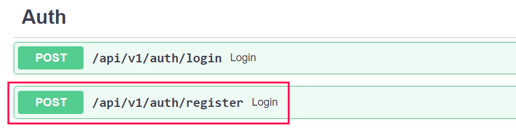
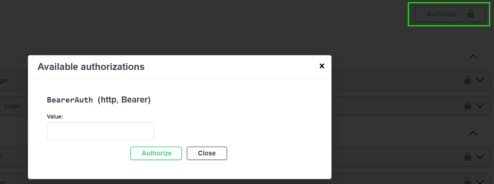
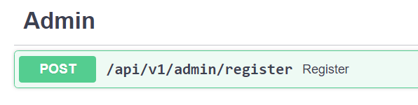

## Role Based Authentication JWT 🛡

This project implement a custom role based authentication in FastAPI with JWT

<p align="center">
<a href="https://fastapi.tiangolo.com/" target="blank"></a>
<a href="https://jwt.io/" target="blank"></a>
</p>


### How works? 🔧

1. First, you need to declare your existing roles in the database in the enums

```python
from enum import StrEnum, unique, auto

@unique
class RoleEnum(StrEnum):
    @staticmethod
    def _generate_next_value_(name, *args):
        return name.upper()
    
    ADMIN = auto()
    USER = auto()
    SUPPORT = auto()
```
> In this example exists `ADMIN`, `USER` and `SUPPORT` roles.


2. Then, register a user



> For demonstration purposes, the users you register will be administrators by default, **don't do this in production!**

3. Login and copy paste the JWT 



4. And now you can register other users with one or more roles



---

### Documentation 📃

```python
@test.post("/", dependencies=[Depends(PreAuthorize(allowed_roles=[RoleEnum.ADMIN])])
```

#### All parameters:

+ `allowed_roles: List[RoleEnum]`: List of roles, indicate which roles are authorized
            
+ `allow_all: bool`: Boolean indicating all roles are authorized.

+ `strict_roles: bool`: Indicates that a user must have strictly the indicated roles, no more roles, or contain the indicated roles.


---


### Docker Deploy 🐳

1. To deploy only run the command

```bash
docker-compose up
```

And just wait while all is building... 😁. FastAPI is up on **8000** port ⚡

> [!IMPORTANT]
> For testing only, the password of all users is **`Test123123!$`**
